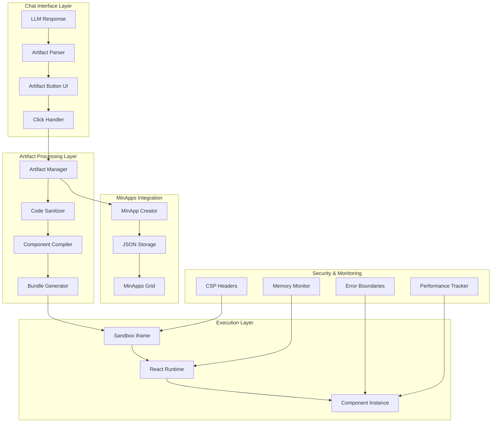
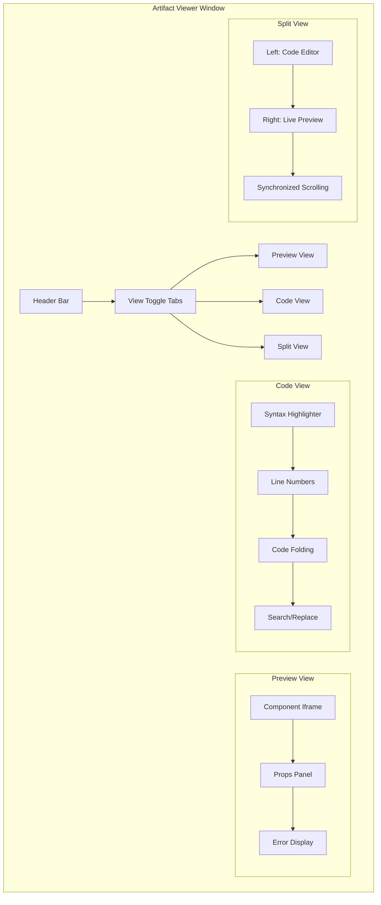

# React Artifacts System Specification

## Overview

This document outlines the comprehensive implementation strategy for integrating React.js artifact rendering capabilities into PrometheusStudio, enabling AI-generated single-file React components to execute as isolated mini-applications with full component lifecycle management, state handling, error boundaries, sandboxed execution environment, and seamless integration with existing development workflows.

## Table of Contents

1. [Architecture Overview](#architecture-overview)
2. [Artifact Protocol](#artifact-protocol)
3. [Security Model](#security-model)
4. [UI/UX Design](#uiux-design)
5. [Technical Implementation](#technical-implementation)
6. [Integration Strategy](#integration-strategy)
7. [Performance & Resource Management](#performance--resource-management)
8. [Export & Deployment](#export--deployment)
9. [Development Workflow](#development-workflow)
10. [Artifact Viewer Interface](#artifact-viewer-interface)
11. [Version Control & History](#version-control--history)
12. [LLM-Based Artifact Editing](#llm-based-artifact-editing)
13. [System Prompt Integration](#system-prompt-integration)
14. [Implementation Roadmap](#implementation-roadmap)

## Architecture Overview

### Core Components



### Technology Stack

- **Frontend**: React 19, TypeScript, Styled Components
- **Bundling**: esbuild for fast compilation
- **Sandboxing**: iframe with strict CSP
- **Storage**: JSON files (similar to custom-minapps.json)
- **Security**: AST-based code sanitization
- **Performance**: Memory monitoring with 50MB limits

## Artifact Protocol

### LLM Response Format

The system will detect and parse artifacts using structured markdown blocks:

```markdown
```artifact:react
{
  "title": "Interactive Counter",
  "description": "A simple counter component with increment/decrement functionality",
  "props": {
    "initialValue": "number",
    "step": "number",
    "maxValue": "number"
  },
  "dependencies": ["react", "styled-components"]
}
```tsx
import React, { useState } from 'react';
import styled from 'styled-components';

const Container = styled.div`
  display: flex;
  flex-direction: column;
  align-items: center;
  padding: 20px;
  font-family: Arial, sans-serif;
`;

const Counter = styled.div`
  font-size: 2rem;
  font-weight: bold;
  margin: 20px 0;
  color: #333;
`;

const Button = styled.button`
  padding: 10px 20px;
  margin: 0 10px;
  font-size: 1rem;
  border: none;
  border-radius: 5px;
  background-color: #007bff;
  color: white;
  cursor: pointer;

  &:hover {
    background-color: #0056b3;
  }

  &:disabled {
    background-color: #ccc;
    cursor: not-allowed;
  }
`;

const InteractiveCounter = ({
  initialValue = 0,
  step = 1,
  maxValue = 100
}) => {
  const [count, setCount] = useState(initialValue);

  const increment = () => {
    setCount(prev => Math.min(prev + step, maxValue));
  };

  const decrement = () => {
    setCount(prev => Math.max(prev - step, 0));
  };

  return (
    <Container>
      <h2>Interactive Counter</h2>
      <Counter>{count}</Counter>
      <div>
        <Button onClick={decrement} disabled={count <= 0}>
          -
        </Button>
        <Button onClick={increment} disabled={count >= maxValue}>
          +
        </Button>
      </div>
    </Container>
  );
};

export default InteractiveCounter;
```
```
```

### Artifact Detection

The system will use regex patterns to detect artifact blocks:

```typescript
const ARTIFACT_PATTERN = /```artifact:react\n([\s\S]*?)\n```tsx\n([\s\S]*?)\n```/g;
```

### Metadata Schema

```typescript
interface ArtifactMetadata {
  title: string;
  description: string;
  props?: Record<string, string>;
  dependencies?: string[];
  version?: string;
  author?: string;
  tags?: string[];
}
```

## Security Model

### Multi-Layer Security Approach

1. **Code Sanitization (AST-based)**
   - Remove dangerous patterns (eval, Function constructor, etc.)
   - Validate import statements against whitelist
   - Strip potentially harmful DOM manipulation

2. **iframe Sandboxing**
   - Separate origin for each component
   - Strict Content Security Policy
   - No access to parent window APIs

3. **Dependency Control**
   - Curated whitelist of safe libraries
   - Version pinning for security
   - No dynamic imports or external CDN access

4. **Resource Limits**
   - 50MB memory limit per component
   - 5-second execution timeout
   - Automatic cleanup on errors

### Allowed Dependencies

```typescript
const ALLOWED_DEPENDENCIES = {
  'react': '^19.0.0',
  'react-dom': '^19.0.0',
  'styled-components': '^6.1.11',
  'lodash': '^4.17.21',
  'dayjs': '^1.11.11',
  'uuid': '^10.0.0'
};
```

### Content Security Policy

```typescript
const CSP_HEADERS = {
  'default-src': "'self'",
  'script-src': "'self' 'unsafe-inline'",
  'style-src': "'self' 'unsafe-inline'",
  'img-src': "'self' data: blob:",
  'connect-src': "'none'",
  'frame-src': "'none'",
  'object-src': "'none'"
};
```

## UI/UX Design

### Artifact Button Design

Based on UX research, we'll use a **horizontal rounded rectangle button** approach:

```typescript
interface ArtifactButtonProps {
  title: string;
  description: string;
  onOpen: () => void;
  isLoading?: boolean;
}

const ArtifactButton = ({ title, description, onOpen, isLoading }) => (
  <ArtifactContainer onClick={onOpen}>
    <ArtifactIcon>⚛️</ArtifactIcon>
    <ArtifactContent>
      <ArtifactTitle>{title}</ArtifactTitle>
      <ArtifactDescription>{description}</ArtifactDescription>
    </ArtifactContent>
    <OpenButton disabled={isLoading}>
      {isLoading ? 'Loading...' : 'Open'}
    </OpenButton>
  </ArtifactContainer>
);
```

### Integration with Chat Interface

- Artifacts appear as interactive buttons within chat messages
- Clicking opens the component as a MinApp
- Visual indicators show artifact type and status
- Smooth animations for loading and error states

## Technical Implementation

### Extended MinAppType

```typescript
export type MinAppType = {
  id: string;
  name: string;
  logo?: string;
  url?: string; // Optional for React artifacts
  reactCode?: string; // New: React component source code
  reactMetadata?: ArtifactMetadata; // New: Component metadata
  reactProps?: Record<string, any>; // New: Component props
  dependencies?: string[]; // New: Required npm packages
  type: 'Custom' | 'Default' | 'ReactArtifact'; // Extended
  bodered?: boolean;
  background?: string;
  style?: CSSProperties;
  addTime?: string;
};
```

### Component Compilation Service

```typescript
interface CompilerService {
  compile(code: string, metadata: ArtifactMetadata): Promise<CompilationResult>;
  validate(code: string): ValidationResult;
  sanitize(code: string): string;
}

interface CompilationResult {
  bundledCode: string;
  sourceMap?: string;
  dependencies: string[];
  errors: CompilationError[];
  warnings: CompilationWarning[];
## Artifact Viewer Interface

### Split View Design

The artifact viewer will feature a sophisticated split-view interface with preview and code views:



### View Modes

1. **Preview Mode**: Full-screen component rendering with props configuration
2. **Code Mode**: Syntax-highlighted TSX code with editing capabilities
3. **Split Mode**: Side-by-side code and preview with real-time updates

### Code Editor Features

```typescript
interface CodeEditorProps {
  code: string;
  language: 'tsx' | 'jsx' | 'typescript' | 'javascript';
  theme: 'dark' | 'light';
  readOnly?: boolean;
  onCodeChange?: (newCode: string) => void;
  showLineNumbers?: boolean;
  enableCodeFolding?: boolean;
  enableSearch?: boolean;
}

const ArtifactCodeEditor = ({
  code,
  language,
  theme,
  readOnly = false,
  onCodeChange,
  showLineNumbers = true,
  enableCodeFolding = true,
  enableSearch = true
}) => {
  return (
    <SyntaxHighlighter
      language={language}
      style={theme === 'dark' ? vscDarkPlus : vs}
      showLineNumbers={showLineNumbers}
      customStyle={{
        margin: 0,
        padding: '16px',
        fontSize: '14px',
        fontFamily: 'Monaco, Menlo, "Ubuntu Mono", monospace'
      }}
      codeTagProps={{
        style: {
          fontFamily: 'Monaco, Menlo, "Ubuntu Mono", monospace'
        }
      }}
    >
      {code}
    </SyntaxHighlighter>
  );
};
```

### Preview Panel Features

```typescript
interface PreviewPanelProps {
  artifactId: string;
  props: Record<string, any>;
  onPropsChange: (newProps: Record<string, any>) => void;
  onError: (error: Error) => void;
}

const ArtifactPreviewPanel = ({
  artifactId,
  props,
  onPropsChange,
  onError
}) => {
  const [viewMode, setViewMode] = useState<'mobile' | 'tablet' | 'desktop'>('desktop');
  const [showProps, setShowProps] = useState(true);

  return (
    <PreviewContainer>
      <PreviewToolbar>
        <ViewportSelector value={viewMode} onChange={setViewMode} />
        <PropsToggle checked={showProps} onChange={setShowProps} />
        <RefreshButton onClick={() => window.location.reload()} />
      </PreviewToolbar>

      <PreviewFrame viewport={viewMode}>
        <ComponentSandbox
          artifactId={artifactId}
          props={props}
          onError={onError}
        />
      </PreviewFrame>

      {showProps && (
        <PropsPanel
          props={props}
          onChange={onPropsChange}
          schema={getPropsSchema(artifactId)}
        />
      )}
    </PreviewContainer>
  );
};
```

## Version Control & History

### Version Storage Schema

```typescript
interface ArtifactVersion {
  id: string;
  artifactId: string;
  version: number;
  code: string;
  metadata: ArtifactMetadata;
  parentVersion?: number;
  createdAt: string;
  createdBy: 'user' | 'llm';
  changeDescription: string;
  diffSummary: {
    linesAdded: number;
    linesRemoved: number;
    linesModified: number;
  };
}

interface ArtifactHistory {
  artifactId: string;
  currentVersion: number;
  versions: ArtifactVersion[];
  branches?: ArtifactBranch[];
}
```

### Version Management System

```typescript
class ArtifactVersionManager {
  private storage: ArtifactStorage;

  async createVersion(
    artifactId: string,
    newCode: string,
    changeDescription: string,
    createdBy: 'user' | 'llm' = 'user'
  ): Promise<ArtifactVersion> {
    const currentHistory = await this.getHistory(artifactId);
    const newVersion = currentHistory.currentVersion + 1;

    const diffSummary = this.calculateDiff(
      currentHistory.versions[currentHistory.currentVersion - 1]?.code || '',
      newCode
    );

    const version: ArtifactVersion = {
      id: generateId(),
      artifactId,
      version: newVersion,
      code: newCode,
      metadata: await this.extractMetadata(newCode),
      parentVersion: currentHistory.currentVersion,
      createdAt: new Date().toISOString(),
      createdBy,
      changeDescription,
      diffSummary
    };

    await this.storage.saveVersion(version);
    await this.storage.updateCurrentVersion(artifactId, newVersion);

    return version;
  }

  async rollbackToVersion(artifactId: string, targetVersion: number): Promise<void> {
    const history = await this.getHistory(artifactId);
    const targetVersionData = history.versions.find(v => v.version === targetVersion);

    if (!targetVersionData) {
      throw new Error(`Version ${targetVersion} not found`);
    }

    // Create a new version based on the target version
    await this.createVersion(
      artifactId,
      targetVersionData.code,
      `Rollback to version ${targetVersion}`,
      'user'
    );
  }

  async compareVersions(
    artifactId: string,
    version1: number,
    version2: number
  ): Promise<VersionDiff> {
    const history = await this.getHistory(artifactId);
    const v1 = history.versions.find(v => v.version === version1);
    const v2 = history.versions.find(v => v.version === version2);

    if (!v1 || !v2) {
      throw new Error('One or both versions not found');
    }

    return this.generateDiff(v1.code, v2.code);
  }
}
```

### Version History UI

```typescript
const VersionHistoryPanel = ({ artifactId }: { artifactId: string }) => {
  const [history, setHistory] = useState<ArtifactHistory | null>(null);
  const [selectedVersions, setSelectedVersions] = useState<[number, number]>([1, 2]);

  return (
    <HistoryContainer>
      <HistoryHeader>
        <h3>Version History</h3>
        <CompareButton
          onClick={() => showVersionComparison(selectedVersions)}
          disabled={selectedVersions.length !== 2}
        >
          Compare Selected
        </CompareButton>
      </HistoryHeader>

      <VersionList>
        {history?.versions.map(version => (
          <VersionItem key={version.id}>
            <VersionCheckbox
              checked={selectedVersions.includes(version.version)}
              onChange={(checked) => handleVersionSelect(version.version, checked)}
            />
            <VersionInfo>
              <VersionNumber>v{version.version}</VersionNumber>
              <VersionDate>{formatDate(version.createdAt)}</VersionDate>
              <VersionAuthor>{version.createdBy}</VersionAuthor>
              <VersionDescription>{version.changeDescription}</VersionDescription>
            </VersionInfo>
            <VersionActions>
              <RollbackButton onClick={() => rollbackToVersion(version.version)}>
                Rollback
              </RollbackButton>
              <ViewButton onClick={() => viewVersion(version.version)}>
                View
              </ViewButton>
            </VersionActions>
          </VersionItem>
        ))}
      </VersionList>
    </HistoryContainer>
  );
};
```

## LLM-Based Artifact Editing

### Conversational Editing Protocol

```typescript
interface EditRequest {
  artifactId: string;
  currentVersion: number;
  editInstruction: string;
  context?: string;
  preserveProps?: boolean;
}

interface EditResponse {
  success: boolean;
  newCode?: string;
  explanation: string;
  changesApplied: string[];
  warnings?: string[];
  errors?: string[];
}
```

### LLM Edit Integration

```typescript
class ArtifactEditService {
  private llmClient: LLMClient;
  private versionManager: ArtifactVersionManager;

  async processEditRequest(request: EditRequest): Promise<EditResponse> {
    const currentArtifact = await this.versionManager.getVersion(
      request.artifactId,
      request.currentVersion
    );

    const editPrompt = this.buildEditPrompt(currentArtifact, request);

    try {
      const llmResponse = await this.llmClient.generateEdit(editPrompt);
      const parsedResponse = this.parseEditResponse(llmResponse);

      // Validate the generated code
      const validationResult = await this.validateCode(parsedResponse.newCode);

      if (!validationResult.isValid) {
        return {
          success: false,
          explanation: 'Generated code failed validation',
          changesApplied: [],
          errors: validationResult.errors
        };
      }

      // Create new version with LLM changes
      await this.versionManager.createVersion(
        request.artifactId,
        parsedResponse.newCode,
        `LLM Edit: ${request.editInstruction}`,
        'llm'
      );

      return {
        success: true,
        newCode: parsedResponse.newCode,
        explanation: parsedResponse.explanation,
        changesApplied: parsedResponse.changes
      };

    } catch (error) {
      return {
        success: false,
        explanation: `Edit failed: ${error.message}`,
        changesApplied: [],
        errors: [error.message]
      };
    }
  }

  private buildEditPrompt(artifact: ArtifactVersion, request: EditRequest): string {
    return `
You are editing a React component. Here is the current code:

\`\`\`tsx
${artifact.code}
\`\`\`

Current component metadata:
${JSON.stringify(artifact.metadata, null, 2)}

Edit instruction: ${request.editInstruction}

${request.context ? `Additional context: ${request.context}` : ''}

Please provide the updated code following these guidelines:
1. Maintain the existing component structure unless explicitly asked to change it
2. Preserve existing props unless modifications are requested
3. Keep the same styling approach (styled-components, inline styles, etc.)
4. Ensure the code is valid TypeScript/React
5. Add comments explaining significant changes

Respond with the complete updated component code and a brief explanation of changes made.
    `;
  }
}
```

### Edit UI Integration

```typescript
const ArtifactEditInterface = ({ artifactId }: { artifactId: string }) => {
  const [editInstruction, setEditInstruction] = useState('');
  const [isEditing, setIsEditing] = useState(false);
  const [editHistory, setEditHistory] = useState<EditResponse[]>([]);

  const handleEdit = async () => {
    if (!editInstruction.trim()) return;

    setIsEditing(true);

    try {
      const response = await artifactEditService.processEditRequest({
        artifactId,
        currentVersion: getCurrentVersion(),
        editInstruction,
        preserveProps: true
      });

      setEditHistory(prev => [...prev, response]);

      if (response.success) {
        // Refresh the artifact view
        await refreshArtifact();
        setEditInstruction('');
      }
    } finally {
      setIsEditing(false);
    }
  };

  return (
    <EditContainer>
      <EditInput>
        <TextArea
          value={editInstruction}
          onChange={(e) => setEditInstruction(e.target.value)}
          placeholder="Describe the changes you want to make to this component..."
          rows={3}
        />
        <EditButton
          onClick={handleEdit}
          disabled={isEditing || !editInstruction.trim()}
        >
          {isEditing ? 'Applying Changes...' : 'Apply Edit'}
        </EditButton>
      </EditInput>

      <EditHistory>
        {editHistory.map((edit, index) => (
          <EditHistoryItem key={index} success={edit.success}>
            <EditExplanation>{edit.explanation}</EditExplanation>
            {edit.changesApplied.length > 0 && (
              <ChangesList>
                {edit.changesApplied.map((change, i) => (
                  <ChangeItem key={i}>{change}</ChangeItem>
                ))}
              </ChangesList>
            )}
            {edit.errors && edit.errors.length > 0 && (
              <ErrorsList>
                {edit.errors.map((error, i) => (
                  <ErrorItem key={i}>{error}</ErrorItem>
                ))}
              </ErrorsList>
            )}
          </EditHistoryItem>
        ))}
      </EditHistory>
    </EditContainer>
  );
};
```

## System Prompt Integration

### Core System Prompt Enhancement

```typescript
const ARTIFACT_SYSTEM_PROMPT = `
You are an AI assistant with React artifact generation capabilities. When users request interactive components, demos, or UI elements, you should create React artifacts using the following protocol:

## Artifact Creation Guidelines

1. **When to Create Artifacts:**
   - User requests an interactive component or demo
   - User asks for a UI element or widget
   - User wants to visualize data or create a tool
   - User requests a form, calculator, or interactive example

2. **Artifact Format:**
   Use this exact structure for React artifacts:

   \`\`\`artifact:react
   {
     "title": "Component Name",
     "description": "Brief description of what this component does",
     "props": {
       "propName": "type",
       "anotherProp": "type"
     },
     "dependencies": ["react", "styled-components"]
   }
   \`\`\`tsx
   [Complete React component code here]
   \`\`\`

3. **Code Requirements:**
   - Use functional components with hooks
   - Include proper TypeScript types
   - Use styled-components for styling
   - Implement proper error handling
   - Make components responsive
   - Include meaningful prop defaults
   - Add accessibility attributes

4. **Security Guidelines:**
   - Only use whitelisted dependencies: react, react-dom, styled-components, lodash, dayjs, uuid
   - No external API calls or network requests
   - No dangerous patterns (eval, innerHTML, etc.)
   - No file system access

5. **Best Practices:**
   - Keep components self-contained
   - Use clear, descriptive variable names
   - Include helpful comments
   - Implement proper loading and error states
   - Make components reusable and configurable

## Example Artifact:

\`\`\`artifact:react
{
  "title": "Color Picker",
  "description": "An interactive color picker with hex and RGB display",
  "props": {
    "initialColor": "string",
    "onChange": "function"
  },
  "dependencies": ["react", "styled-components"]
}
\`\`\`tsx
import React, { useState, useCallback } from 'react';
import styled from 'styled-components';

const ColorPicker = ({ initialColor = '#ff0000', onChange }) => {
  const [color, setColor] = useState(initialColor);

  const handleColorChange = useCallback((newColor) => {
    setColor(newColor);
    onChange?.(newColor);
  }, [onChange]);

  return (
    <Container>
      <ColorInput
        type="color"
        value={color}
        onChange={(e) => handleColorChange(e.target.value)}
      />
      <ColorDisplay>
        <ColorSwatch color={color} />
        <ColorInfo>
          <div>Hex: {color}</div>
          <div>RGB: {hexToRgb(color)}</div>
        </ColorInfo>
      </ColorDisplay>
    </Container>
  );
};

export default ColorPicker;
\`\`\`

Remember: Always create artifacts when users request interactive elements, and follow the exact format specified above.
`;
```

### Dynamic Prompt Injection

```typescript
class SystemPromptManager {
  private basePrompt: string;
  private artifactPrompt: string;

  constructor() {
    this.basePrompt = this.loadBasePrompt();
    this.artifactPrompt = ARTIFACT_SYSTEM_PROMPT;
  }

  generateEnhancedPrompt(userMessage: string, context?: ConversationContext): string {
    const shouldEnableArtifacts = this.shouldEnableArtifacts(userMessage, context);

    if (shouldEnableArtifacts) {
      return `${this.basePrompt}\n\n${this.artifactPrompt}\n\nUser: ${userMessage}`;
    }

    return `${this.basePrompt}\n\nUser: ${userMessage}`;
  }

  private shouldEnableArtifacts(message: string, context?: ConversationContext): boolean {
    const artifactTriggers = [
      /create.*component/i,
      /build.*interface/i,
      /make.*interactive/i,
      /show.*example/i,
      /demo/i,
      /calculator/i,
      /form/i,
      /widget/i,
      /tool/i,
      /visualize/i,
      /chart/i,
      /graph/i
    ];

    return artifactTriggers.some(trigger => trigger.test(message)) ||
           context?.hasArtifacts ||
           context?.lastMessageContainedArtifact;
  }
}
```

### Automatic Artifact Detection

```typescript
class ArtifactDetectionService {
  private promptManager: SystemPromptManager;

  async processMessage(
    message: string,
    conversationId: string,
    context: ConversationContext
  ): Promise<ProcessedMessage> {
    // Enhance the prompt with artifact capabilities if needed
    const enhancedPrompt = this.promptManager.generateEnhancedPrompt(message, context);

    // Send to LLM
    const response = await this.llmClient.generateResponse(enhancedPrompt);

    // Parse for artifacts
    const artifacts = this.parseArtifacts(response);

    // Store artifacts if found
    if (artifacts.length > 0) {
      await this.storeArtifacts(artifacts, conversationId);
    }

    return {
      response,
      artifacts,
      hasArtifacts: artifacts.length > 0
    };
  }

  private parseArtifacts(response: string): ParsedArtifact[] {
    const artifactPattern = /```artifact:react\n([\s\S]*?)\n```tsx\n([\s\S]*?)\n```/g;
    const artifacts: ParsedArtifact[] = [];
    let match;

    while ((match = artifactPattern.exec(response)) !== null) {
      try {
        const metadata = JSON.parse(match[1]);
        const code = match[2];

        artifacts.push({
          id: generateId(),
          metadata,
          code,
          createdAt: new Date().toISOString()
        });
      } catch (error) {
        console.error('Failed to parse artifact:', error);
      }
    }

    return artifacts;
  }
}
```

}
```

### Sandbox Runtime

```typescript
interface SandboxRuntime {
  create(component: ReactArtifact): Promise<SandboxInstance>;
  destroy(instanceId: string): void;
  updateProps(instanceId: string, props: Record<string, any>): void;
  getPerformanceMetrics(instanceId: string): PerformanceMetrics;
}
```

## Integration Strategy

### Storage Strategy

React artifacts will be stored in `react-artifacts.json`:

```json
{
  "artifacts": [
    {
      "id": "counter-component-001",
      "title": "Interactive Counter",
      "description": "A simple counter component",
      "code": "import React...",
      "metadata": {
        "props": {
          "initialValue": "number",
          "step": "number"
        },
        "dependencies": ["react", "styled-components"]
      },
      "createdAt": "2025-01-25T22:00:00Z",
      "updatedAt": "2025-01-25T22:00:00Z"
    }
  ]
}
```

### MinApps Grid Integration

- React artifacts appear in the same MinApps grid
- Special icon (⚛️) indicates React component type
- Context menu includes "Edit Props", "Export", "View Source"
- Seamless integration with existing MinApp lifecycle

## Performance & Resource Management

### Memory Management

```typescript
interface ResourceMonitor {
  trackMemoryUsage(instanceId: string): void;
  enforceMemoryLimit(limit: number): void;
  cleanupOnLimit(): void;
  getResourceStats(): ResourceStats;
}

interface ResourceStats {
  totalMemoryUsed: number;
  activeInstances: number;
  averageLoadTime: number;
  errorRate: number;
}
```

### Performance Limits

- **Memory Limit**: 50MB per component instance
- **Execution Timeout**: 5 seconds for initial render
- **Bundle Size Limit**: 2MB compiled code
- **Concurrent Instances**: Maximum 5 active components

### Optimization Strategies

1. **Lazy Loading**: Components load only when opened
2. **Code Splitting**: Separate bundles for dependencies
3. **Memory Cleanup**: Automatic garbage collection
4. **Error Recovery**: Graceful degradation on failures

## Export & Deployment

### Export Formats

1. **Standalone HTML Bundle**
   ```html
   <!DOCTYPE html>
   <html>
   <head>
     <title>Interactive Counter</title>
     <style>/* Compiled CSS */</style>
   </head>
   <body>
     <div id="root"></div>
     <script>/* Bundled React + Component */</script>
   </body>
   </html>
   ```

2. **TSX Source File**
   ```typescript
   // Clean, formatted TypeScript React component
   // With proper imports and type definitions
   ```

3. **Component Package** (Future)
   ```json
   {
     "name": "@artifacts/interactive-counter",
     "version": "1.0.0",
     "main": "dist/index.js",
     "types": "dist/index.d.ts"
   }
   ```

### Export API

```typescript
interface ExportService {
  exportAsHTML(artifactId: string): Promise<string>;
  exportAsTSX(artifactId: string): Promise<string>;
  exportAsPackage(artifactId: string): Promise<Buffer>;
  generateShareableLink(artifactId: string): Promise<string>;
}
```

## Development Workflow

### System Prompt Enhancement

```markdown
## React Artifact Generation Guidelines

When creating React components, follow this structure:

1. **Use the artifact:react block format**
2. **Include comprehensive metadata**
3. **Write clean, self-contained components**
4. **Use only whitelisted dependencies**
5. **Include proper TypeScript types**
6. **Add meaningful prop defaults**
7. **Implement error boundaries**
8. **Follow accessibility best practices**

### Example Structure:
- Functional components with hooks
- Styled-components for styling
- Clear prop interfaces
- Responsive design
- Error handling
```

### Hot Reloading

```typescript
interface HotReloadService {
  enableHotReload(instanceId: string): void;
  updateComponent(instanceId: string, newCode: string): void;
  reloadDependencies(instanceId: string): void;
  getReloadHistory(instanceId: string): ReloadEvent[];
}
```

### Component Inspector

```typescript
interface ComponentInspector {
  inspectProps(instanceId: string): PropInspection;
  inspectState(instanceId: string): StateInspection;
  inspectPerformance(instanceId: string): PerformanceInspection;
  generateReport(instanceId: string): InspectionReport;
}
```

## Implementation Roadmap

### Phase 1: Core Foundation (Weeks 1-2)
- [x] Research and evaluate sandboxing approaches
- [x] Research Claude artifacts protocol and UI patterns
- [ ] Design core architecture for React artifact rendering system
- [ ] Create artifact detection and parsing system for LLM responses
- [ ] Design UI interface - horizontal button implementation
- [ ] Extend MinAppType to support React components
- [ ] Create basic React component sandbox infrastructure

### Phase 2: Security & Compilation (Weeks 3-4)
- [ ] Implement React component compilation and bundling service using esbuild
- [ ] Build component lifecycle management system with error boundaries
- [ ] Create secure code evaluation engine with CSP and sanitization
- [ ] Add dependency injection system for curated safe libraries
- [ ] Create performance monitoring and resource optimization
- [ ] Add comprehensive security protocols including XSS prevention

### Phase 3: Integration & Features (Weeks 5-6)
- [ ] Integrate with existing MinApps workflow and UI components
- [ ] Implement hot-reloading and real-time preview capabilities
- [ ] Build component prop configuration interface with JSON schema validation
- [ ] Implement export functionality for standalone HTML and TSX file export
- [ ] Create system prompt enhancement for LLM artifact generation protocol

### Phase 4: Advanced Features (Weeks 7-8)
- [ ] Add version control integration for component history and rollback
- [ ] Build collaborative editing features with real-time sync via WebSockets
- [ ] Implement accessibility compliance validation using axe-core
- [ ] Add cross-browser compatibility testing framework
- [ ] Create mobile-responsive design adaptation system with viewport simulation

### Phase 5: Polish & Documentation (Week 9)
- [ ] Create documentation and developer tools including component inspector
- [ ] Performance optimization and testing
- [ ] User acceptance testing
- [ ] Final security audit
- [ ] Release preparation

## Success Metrics

### Technical Metrics
- **Security**: Zero XSS vulnerabilities, 100% code sanitization coverage
- **Performance**: <2s component load time, <50MB memory usage
- **Reliability**: >99% uptime, <1% error rate
- **Compatibility**: Support for all major React patterns

### User Experience Metrics
- **Usability**: <5 clicks to create and deploy artifact
- **Adoption**: >80% of users try artifact feature within first week
- **Satisfaction**: >4.5/5 user rating for artifact experience
- **Productivity**: 50% reduction in time to create interactive demos

## Risk Mitigation

### Security Risks
- **Mitigation**: Multi-layer security with AST analysis, CSP, and sandboxing
- **Monitoring**: Real-time security scanning and anomaly detection

### Performance Risks
- **Mitigation**: Resource limits, memory monitoring, and automatic cleanup
- **Monitoring**: Performance metrics dashboard and alerting

### Compatibility Risks
- **Mitigation**: Comprehensive testing matrix and fallback mechanisms
- **Monitoring**: Cross-platform compatibility testing automation

## Conclusion

This specification provides a comprehensive roadmap for implementing a secure, performant, and user-friendly React artifacts system in PrometheusStudio. The phased approach ensures steady progress while maintaining system stability and security throughout the development process.

The system will enable users to seamlessly create, preview, and deploy interactive React components generated by AI, significantly enhancing the platform's capabilities for rapid prototyping and development workflows.
